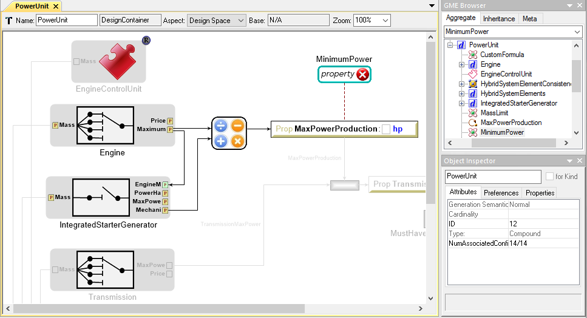

# design-space-example
This OpenMETA project demonstrates the variability structures and constraints available as part of the Design Space feature.

## Variability Model
Our sample project is based on component selection for the drivetrain for a heavy vehicle. We want to consider a number of diesel engines as transmissions, as well as options for a hybrid drivetrain.

In this architecture, we always have a **Diesel Engine** and a **Transmission**, and we have several _**alternatives**_ for each. They are joined by a driveshaft. We will always have a **Drivetrain Control Unit** that controls these via the CAN bus.

_**Optionally**_, we may turn this into a hybrid drivetrain by adding an **Integrated Starter-Generator (ISG)** and supporting **Hybrid System Elements**. The Integrated Starter-Generator sits in between the engine and transmission and is connected to each by a driveshaft. The Hybrid System Elements include the **Battery**, for which we have several alternatives. The other Hybrid System Elements are joined to the Drivetrain Control Unit via the CAN bus.

With this variability model, there are 200 possible instantiations of the system. _**Constraints**_ offer a method for rapidly reducing the number of instances under consideration. After applying all of the constraints, only 14 of the 200 possibilities remain.

## Constraints
With _**constraints**_, we can express the criteria that each combination must meet in order to be valid. There are two types of constraints that we will consider here: _**property**_ and _**implication**_.

Constraint Name | Concept | Type
--------------- | ------- | ----
[MustHaveTransmissionOverhead](#musthavetransmissionoverhead) | The combined power of the engine and ISG cannot exceed the power-handling capacity of the transmission. | property
[HybridSystemElementConsistency](#hybridsystemelementconsistency) | If the ISG is selected for inclusion, then the other Hybrid System Elements must also be selected, and vice-versa. | implication
[MassLimit](#masslimit) | The total mass of all components must not exceed 2,000 kg. | property
[MustBeAbleToHandleEnginePower](#mustbeabletohandleenginepower) | If an ISG is selected, it must be capable of handling the power output of the engine. | property
[MinimumPower](#minimumpower) | The drivetrain must be capable of producing at least 500 hp. | property

### MustHaveTransmissionOverhead
_The combined power of the engine and ISG cannot exceed the power-handling capacity of the transmission._

For this constraint, we add the maximum power properties of the diesel engine and ISG components, subtract the power-handling capacity of the transmission, and check that the resulting value is greater than zero.

`(Diesel Power) + (ISG Power) - (Transmission Power Capacity) > 0`

To represent this, we first take the **MaximumPower** attribute from **Engine** and the **MechanicalPowerProductionMax** attribute from **IntegratedStarterGenerator** and route them into a _**SimpleFormula**_, whose output we assign the **MaxPowerProduction**.

From **Transmission** we take the **MaxPower** attribute and connect it to a _**Custom Formula**_ while renaming the variable **TransmissionMaxPower**. We assign **MaxPowerProduction** to that same _**Custom Formula**_, and enter the following formula in its _**Expression**_ attribute:

`TransmissionMaxPower - MaxPowerProduction`

We take the output of the _**Custom Formula**_ and assign it to **TransmissionPowerOverhead**.

Finally, we create a _**Property Constraint**_ called _MustHaveTransmissionOverhead_ and attach it to **TransmissionPowerOverhead**. We set the constraint's _**TargetValue**_ to `0` and its _**TargetType**_ to `Must Exceed`.

### HybridSystemElementConsistency
_If the ISG is selected for inclusion, then the other Hybrid System Elements must also be selected, and vice-versa._

For this constraint, we capture the idea that these two elements must either be selected together or not selected at all. To represent this, we create a _**Visual Constraint**_ called **HybridSystemElementConsistency**. It will ensure that, if we choose to have an integrated starter-generator, then the required supporting elements will be selected as well. It will also ensure that we don't select those supporting elements unless we have an integrated starter-generator that will benefit from their inclusion.

Navigate into **HybridSystemElementConsistency** to see its _implication_ rules. There are two references: one to **HybridSystemElements** and one to **IntegratedStarterGenerator**. The directed lines between them are marked with the word _**implies**_. This means that if **HybridSystemElements** is selected, it implies that **IntegratedStarterGenerator** was selected also. Because we have directed lines in both directions, this means that the reverse is also true.

Any _valid_ system configuration will need to either have both of these items or none of them.

### MassLimit
_The total mass of all components must not exceed 2,000 kg._

For this constraint, we want to sum the mass of all of the components in our system, and only consider configurations where the total mass is 2,000 kg or less.

We take the **Mass** property from each of the elements in our system and add them together using a _**SimpleFormula**_ in `addition` mode, sending the result to **TotalMass**. We then attach a _**PropertyConstraint**_ called **MassLimit** with _**TargetValue**_ of `2000` and _**TargetType**_ of `Must Exceed`.

### MustBeAbleToHandleEnginePower
_If an ISG is selected, it must be capable of handling the power output of the engine._

This constraint only applies for configurations where the **IntegratedStarterGenerator** is selected. In those cases, we want to ensure that the ISG is rated to handle the maximum power that can be created by the engine.

At the system level, we take the **Engine**'s **MaximumPower** property and send it into the **IntegratedStarterGenerator** _**Optional**_ container. This will make it available for the constraint which we will define inside of it.

Inside the **IntegratedStarterGenerator** container, we calculate the **PowerHandlingMargin** of the ISG by taking its **MaxPowerHandling** value and subtracting the **EngineMaxPower** that we retrieved from the engine at the system level. We then attach the _**PropertyConstraint**_ **MustBeAbleToHandleEnginePower** to that value, with **TargetValue** of `0` and **TargetType** of `Must Exceed`.

### MinimumPower
_The drivetrain must be capable of producing at least 500 hp._

For this constraint, we want to sum the power-producing capability of the diesel engine and, if selected, the integrated starter-generator. The resulting power must meet or exceed 500 hp.

We take the **MaximumPower** property from **Engine** and the **MechanicalPowerProductionMax** property from **IntegratedStarterGenerator** and sum them using a _**SimpleFormula**_, sending the result to the **MaxPowerProduction** property. We attach the _**PropertyConstraint**_ **MinimumPower** to that value, with **TargetValue** of `500` and **TargetType** of `Must Meet or Exceed`.

